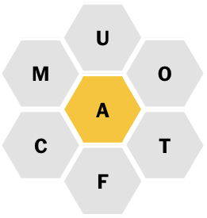
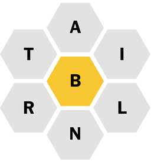

Quiz 1
======

This is a limited time quiz. Do as many tasks as possible before the time runs
out. You get 1 point for each task completed. The instructor and TA will not
answer any questions until the quiz is over.

## Task 0: Update MCB185 ##

In order to see the entirety of the quiz questions, you will have to `git pull`
the MCB185 repo to refresh its contents.

## Task 1: quiz1.sh ##

Create a file `quiz1.sh` in your homework repo and push it to GitHub.

## Task 2: nano ##

Edit `quiz1.sh` with `nano` to report your real name and Linux user name. Push
to GitHub.

## Task 3: Spelling Bee ##

Add to `quiz1.sh` the solution to the following NYT Spelling Bee puzzle. Your
script must run from your `mcb185_homework` directory and report the number of
words from each puzzle. Push to GitHub.



## Task 4: More Spelling Bees ##

Also provide solutions for the following puzzles in `quiz1.sh`.




Don't forget to push.

## Task 5: JASPAR Taxa ##

Add to `quiz1.sh` a command line that reports the number taxonomy groups in the
JASPAR core. You will find the file in `MCB185/data`. Push to GitHub.

```
   1 diatoms
  94 urochordates
 103 nematodes
 178 fungi
 286 insects
 805 plants
 879 vertebrates
```

## Task 6: Collaborators ##

Add to `quiz1.sh` the names of your co-authors.
